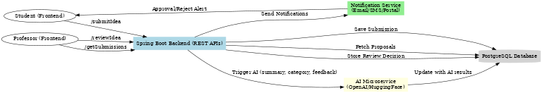
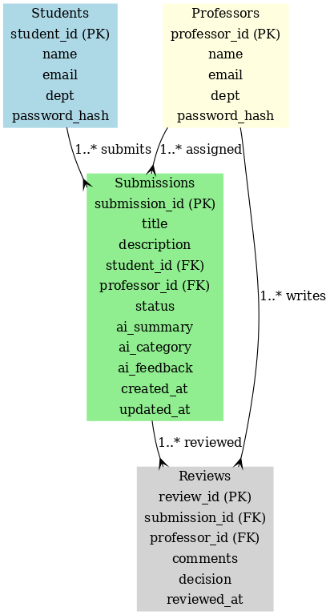
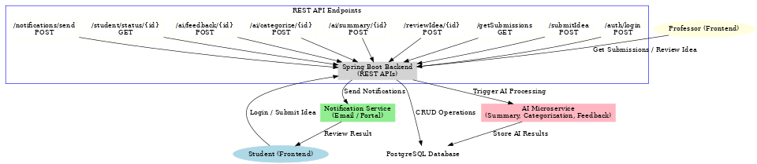
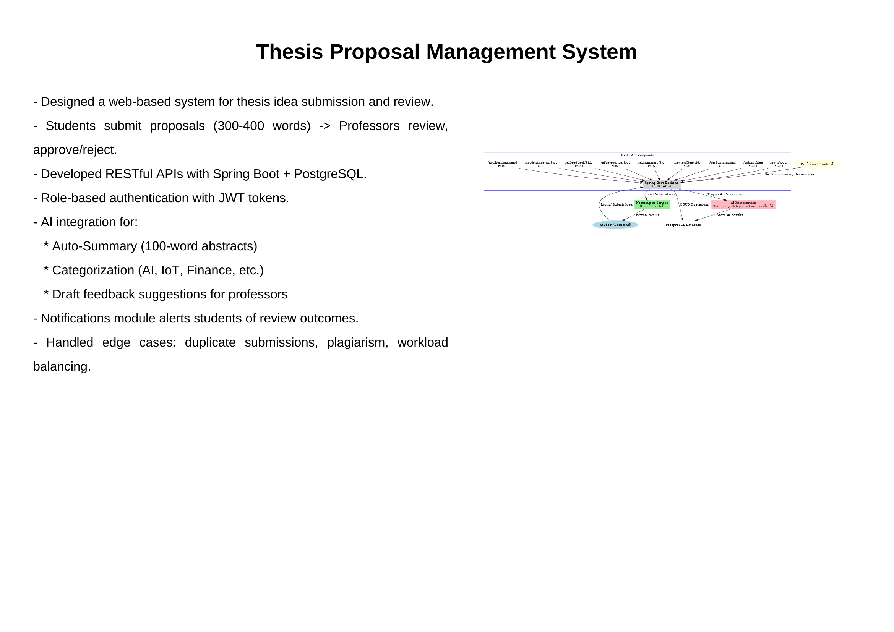

# 🎓 Thesis Proposal Management System

A web-based system for **thesis idea submission & review** with **AI integration**.  
Built using **Java Spring Boot + PostgreSQL**, with AI microservices for summarization, categorization, and feedback generation.

---

## 🚀 Features
- Student submits thesis idea (300–400 words).
- Professor reviews → Approves / Rejects with comments.
- Notifications sent to students on review outcome.
- Role-based authentication (JWT).
- AI Integration:
  - **Auto-Summary** → Concise 100-word abstract.
  - **Categorization** → Tags ideas into domains (AI, IoT, Finance, etc.).
  - **Review Assistance** → Draft feedback for professors.

---

## 🏗️ Architecture

### 🔹 API Flow

### 🔹 ER Diagram (Database Schema)

### 🔹 System Architecture + API Endpoints

### 🔹 Project Summary Slide

---

## 📂 Tech Stack
- **Backend:** Spring Boot (REST APIs)
- **Database:** PostgreSQL
- **Auth:** JWT Tokens
- **AI Integration:** OpenAI/HuggingFace Microservices
- **Notifications:** Email / Portal Alerts

---

## 📌 Resume Points
- Designed and implemented a complete **thesis proposal management system** with role-based workflows.
- Developed **RESTful Spring Boot APIs** with PostgreSQL persistence.
- Integrated **AI microservices** for summarization, categorization, and draft feedback.
- Built **notification services** to keep students updated on proposal status.
- Optimized for **scalability & professor workload balancing**.
"# Thesis-track" 
